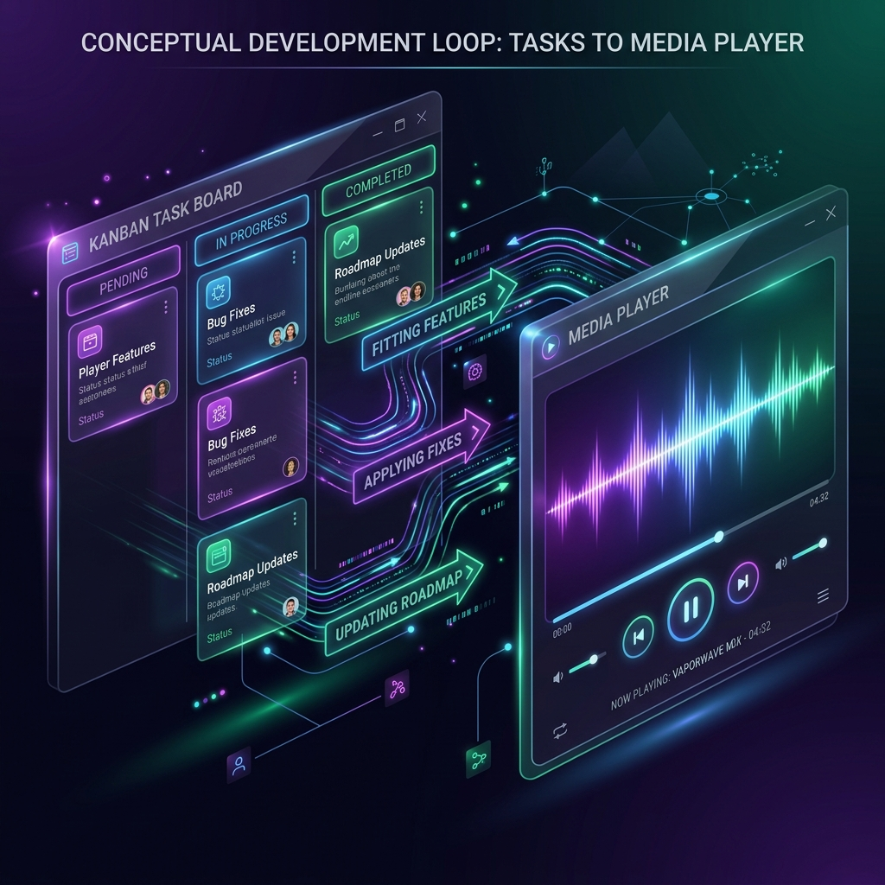
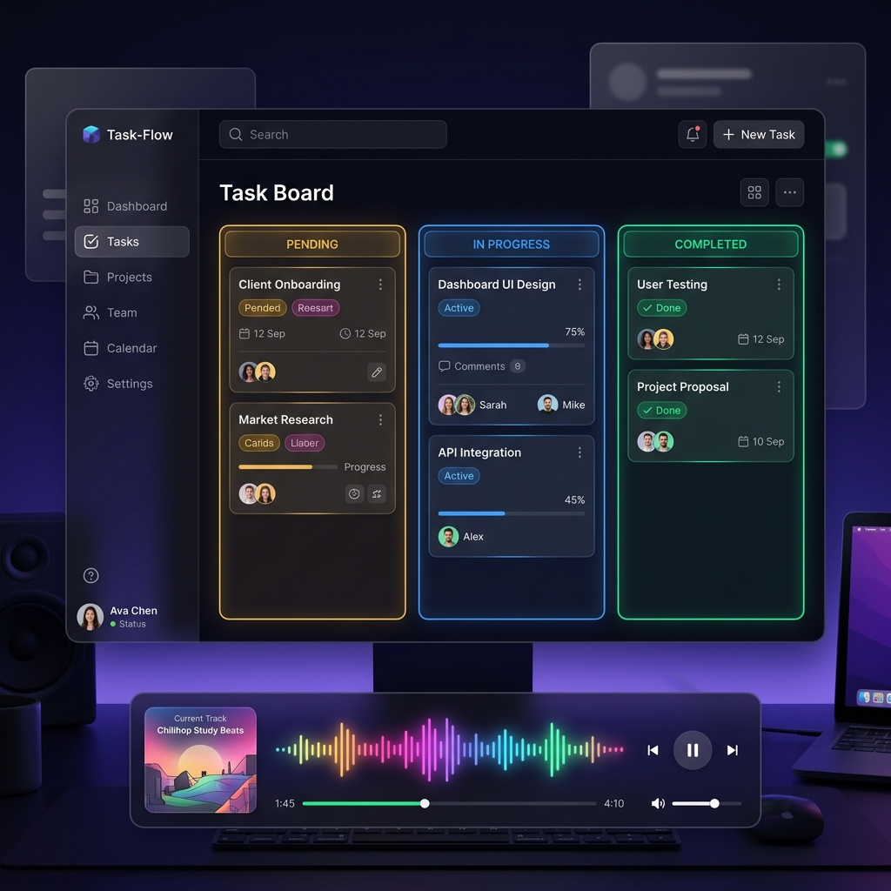

# 🚀 Task-Flow 프로젝트 개발 가이드 (gemini.md)

이 문서는 AI 어시스턴트 Gemini가 파악한 **Task-Flow** 프로젝트의 현황을 바탕으로, 프로젝트의 아키텍처, 빌드 및 실행 방법, 그리고 향후 개발 방향성(Roadmap)을 요약한 가이드라인입니다.

---

## 1. 📋 프로젝트 개요
`Task-Flow`는 **미디어 플레이어**와 **진척도 관리(Kanban Board)** 기능이 유기적으로 결합된 복합 생산성 향상 플랫폼입니다.
* **주요 목적**: 사용자가 음악이나 비디오를 재생하고 감상하는 동시에, 작업(Task)의 진척 상황을 모니터링하고 시각적으로 확인하여 작업의 지속적인 동기부여와 능률을 돕습니다.

---

## 2. 🛠 빌드 및 실행 가이드

이 프로젝트는 **Next.js 16 (App Router)** 기반으로 작성되었으며, 다음과 같은 명령어로 로컬 서버 기동 및 프로덕션 빌드를 수행할 수 있습니다.

### 2.1 개발 서버 실행
```bash
npm run dev
```
* 개발용 로컬 서버가 `http://localhost:3000`에서 실행됩니다.
* 소스 코드 변경 시 브라우저에 즉각 반영되는 핫 리로딩(Hot Reloading)이 지원됩니다.

### 2.2 프로덕션 빌드
```bash
npm run build
```
* 최적화 및 경량화 과정을 거친 정적/서버 사이드 렌더링 파일들을 `.next` 폴더에 생성합니다.

### 2.3 프로덕션 서버 시작
```bash
npm run start
```
* 빌드가 완료된 결과물을 기반으로 고성능 프로덕션 모드 서버를 구동합니다.

---

## 3. 🎯 향후 개발 방향성 (Roadmap)

현재 미디어 플레이어 핵심 동작과 기본 칸반 보드 인터페이스가 성공적으로 기동되는 상태입니다. 추후 다음과 같은 핵심 로드맵에 따라 개발을 확장하는 것을 추천합니다.

### 📍 1단계: 미구현 경로(Router) 활성화 및 UX 개선
* **체크리스트 전용 뷰 (`src/app/checklist`)**:
  * 현재 생성되어 있는 빈 폴더를 활용하여 단순 체크박스 형태의 오늘 할 일(TO-DO)을 쉽고 빠르게 모아보는 전용 뷰 및 위젯 컴포넌트 추가.
* **드래그 앤 드롭 칸반 보드 (`src/app/board`)**:
  * 현재 `progress` 페이지 내 인라인 상태 버튼 전환 방식을 넘어, HTML5 Drag and Drop API 또는 `react-beautiful-dnd`류의 라이브러리를 활용하여 카드를 드래그해 열(Column)을 이동시키는 본격적인 칸반 보드 완성.

### 📍 2단계: 데이터 저장소 고도화 (Database Integration)
* **SQLite / Prisma 도입**:
  * 현재 로컬 `/data/*.json` 파일에 의존하는 스토어 구조(`src/lib/store.ts`)를 SQLite 또는 PostgreSQL 같은 안정적인 내장/서버 데이터베이스로 교체하여 데이터 정합성 보장.
* **사용자별 작업 공간 세분화**:
  * 단순 단일 데이터 파일이 아닌, 사용자 계정 생성 혹은 다중 공간(Workspace) 관리 기능을 추가하여 고도화.

### 📍 3단계: 미디어 플레이어 고도화
* **미디어 메타데이터 파싱**:
  * 파일 업로드 시 오디오/비디오 메타데이터를 분석하여 아티스트명, 앨범 커버 이미지, 정확한 재생 시간 등을 서버 측에서 추출하여 화면에 표시.
* **오디오 재생 편의기능**:
  * 셔플(재생 목록 랜덤 믹스), 한 곡 반복, 전체 반복, 미세 배속 조절 기능 추가.
* **미디어 삭제 및 정밀 제어 (완료)**:
  * **미디어 개별 삭제**: 서버에서 물리적으로 미디어를 제거하는 `DELETE` API 및 프론트엔드 버튼 구현 완료.
  * **원하는 시간 이동 (Interactive Seek Slider)**: 노래 진행 상황 확인은 물론, 마우스 클릭/드래그로 원하는 위치로 자유롭게 이동할 수 있는 탐색 슬라이더 바 구축 완료.
  * **플레이리스트 대기열 분기**: 플레이리스트 재생 시 기존 대기열을 밀어버리고 재생하는 `재생 및 덮어쓰기` 모드와, 뒤에 덧붙이는 `대기열 추가` 모드 완비.

---

## 4. 📂 주요 아키텍처 및 폴더 구조
* **`src/app/`**: Next.js App Router의 주축 경로들
  * **`api/`**: 미디어 업로드/목록 조회, 태스크 상태 업데이트 등을 처리하는 REST API 구현부.
  * **`progress/`**: 태스크 진척도 칸반 보드 및 진행율 도넛/게이지 차트 대시보드 페이지.
* **`src/lib/store.ts`**: 파일 시스템(`fs`) 모듈을 이용해 `/data` 내 JSON 형식의 작업 공간을 로컬 데이터 저장소처럼 활용하는 핵심 백엔드 헬퍼 모듈.
* **`src/types/index.ts`**: `Task`, `MediaFile`, `Playlist` 등 시스템 전반에서 통용되는 공통 타입 시스템 정의.
* **`data/`**: 업로드된 음악 정보와 태스크 정보가 보관되는 로컬 물리 저장소.
* **`design/mockups/`**: 기획 및 로드맵 가이드를 위한 고해상도 디자인 시안이 위치하는 공간.

---

## 5. 🎨 UI/UX 개선 디자인 & 개발 루프 개념도

### 📍 개념적 개발 루프 (Tasks to Media Player)
아래 다이어그램은 칸반 태스크 보드가 어떻게 미디어 플레이어의 기능 구현, 버그 수정, 업데이트 로드맵을 수집하고 동력을 제공하는지 설명해 줍니다.



### 📍 개선된 다크 글래스모피즘 대시보드 시안
아래 목업은 라이트 모드에서 다크 모드 글래스모피즘 테마로 업그레이드될 차세대 대시보드 시안입니다.


